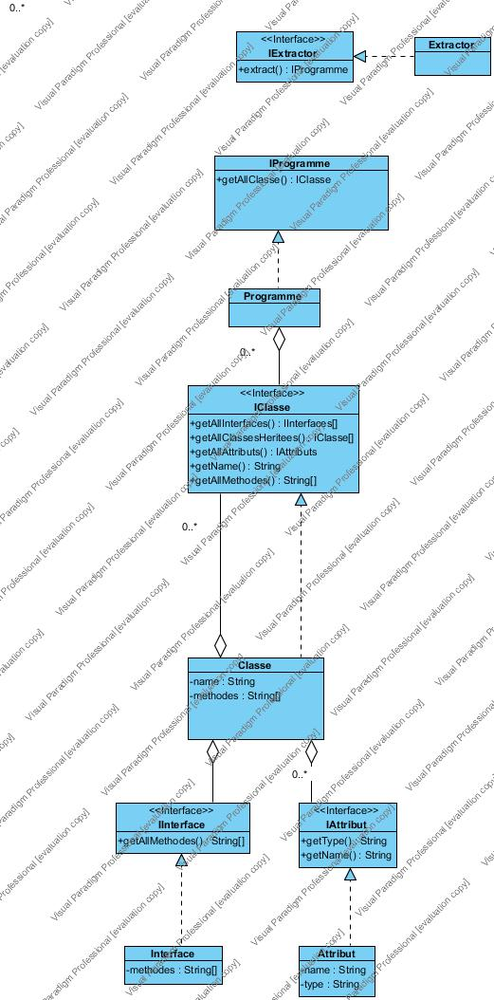

# Architecture_Logicielle

Ce projet a pour but d'analyser la structure d'un code source en java afin d'en générer un diagramme UML en format svg et en format textuel. Pour cela notre projet se décompose en trois grandes parties: Extraction du code source, Analyse du code source, Construction d'un diagramme UML correspondant à la structure du code source. L'extraction du code source se fait à l'aide d'un extracteur utilisant la classe URLClassLoader. 

Nous considérerons que le programme java à analyser en entrée se présente sous la forme d'une archive jar.

Le code source est extrait au sein d'une classe Programme qui implémente une interface IProgramme. L'interface IProgramme contient une méthode `getAllClasses()` qui liste toutes les classes du code source. 

Pour chaque classe listée précedemment, on créé un objet Classe, qui a pour méthodes `getAllInterfaces()` qui liste toutes les interfaces du code source, `getAllClassesHeritees()` qui liste toutes les classes héritées, `getAllAttributs()` qui liste tous les attributs d'une classe, `getName()` qui retourne le nom de la classe et `getMethodes()`qui retourne toutes les méthode de la classe.

La classe Attribut qui implémente l'interface IAttribut ayant pour méthodes `getType()` et `getName()`. La méthode `getType()` retourne le type de l'attribut et la méthode `getNom()` retourne le nom de l'attribut.

Ci joint un diagramme UML représentant l'extracteur de données:

Ces interfaces forment un modèle de données qui est ensuite représenté sous la forme d'un fichier SVG ou de texte.
L'interface `Drawable` sera donc implémentée par ces deux procédés.

Pour la création d'un format SVG nous utilisons la librairie [jFreeSVG](http://www.jfree.org/jfreesvg/) qui permet d'utiliser format
de graphique 2D issu de java.awt et le transforme en fichier SVG. Cela demande de gérer une représentation graphique de bas niveau  - abscisses et ordonnées - pour dessiner et placer les objets du diagramme UML. 

Afin d'organiser la représentation les relations d'héritages, d'aggrégation et de composition - qui impliquent des flèches - les classes seront organisés par étage, après pré-calcul de la taille de la réprésentation de chaque classe.

  

